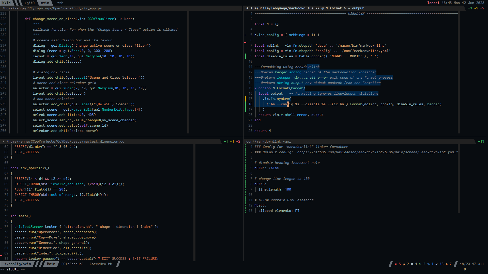
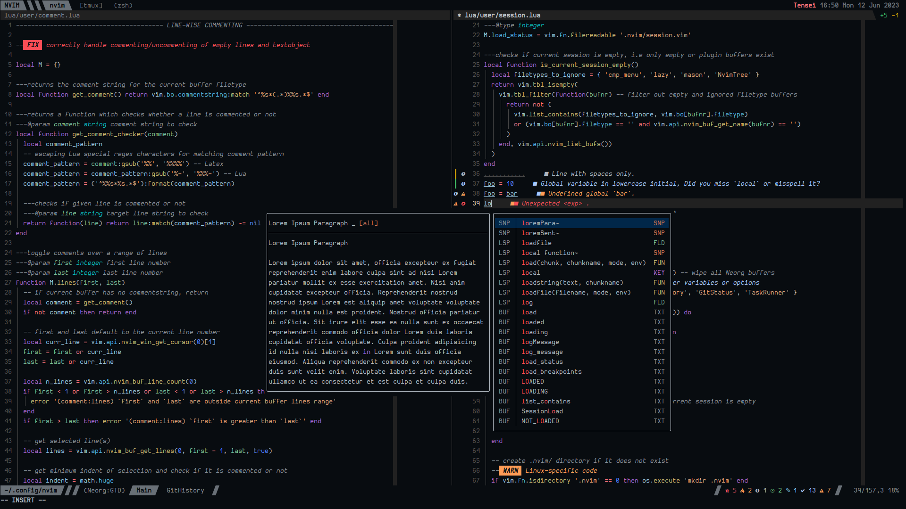

<h1 align="center">Pink as Fox</h1>

A black and pink theme for [neovim](https://github.com/neovim/neovim).

<!-- ## Showcase -->
<!--  -->
<!--  -->

<!-- ## Features -->

<!-- - Support for treesitter and LSP syntax groups for multiple filetypes -->
<!-- - Appropriate color contrast between content and UI to reduce eye strain while maintaining focus -->
<!-- - Darker shades of gray for non-critical UI elements such as separators to reduce distraction -->
<!-- - Consistent usage of the palette across plugins and neovim builtins to provide a unified IDE-like -->
<!-- appearance -->
<!-- - Warmer colors for language syntax groups to attract attention intuitively in dense code -->
<!-- files -->

<!-- #### Integrations -->
<!-- The following plugins have fully customized highlight groups - -->
<!-- - [lazy.nvim](https://github.com/folke/lazy.nvim) -->
<!-- - [nvim-tree.lua](https://github.com/nvim-tree/nvim-tree.lua) -->
<!-- - [gitsigns.nvim](https://github.com/lewis6991/gitsigns.nvim) -->
<!-- - [diffview.nvim](https://github.com/sindrets/diffview.nvim) -->
<!-- - [telescope.nvim](https://github.com/nvim-telescope/telescope.nvim) -->
<!-- - [nvim-lspconfig](https://github.com/neovim/nvim-lspconfig) -->
<!-- - [todo-comments.nvim](https://github.com/folke/todo-comments.nvim) -->
<!-- - [mason.nvim](https://github.com/williamboman/mason.nvim) -->
<!-- - [nvim-dap-ui](https://github.com/rcarriga/nvim-dap-ui) -->
<!-- - [nvim-cmp](https://github.com/hrsh7th/nvim-cmp) -->
<!-- - [neorg](https://github.com/nvim-neorg/neorg) -->

## Installation

Install the colorscheme using the package manager that you love!

[lazy.nvim](https://github.com/folke/lazy.nvim)

```lua
-- LazySpec (plugin specification)
-- return {
{ 'dasupradyumna/pink-as-fox.nvim', lazy = false, priority = 1000 }
-- `lazy` and `priority` are only needed if this is your primary colorscheme to load it first
-- }
```

[packer.nvim](https://github.com/wbthomason/packer.nvim)

```lua
-- inside setup function
-- packer.startup(function(use)
use { 'dasupradyumna/pink-as-fox.nvim' }
-- end)
```

### Requirements

***pink-as-fox.nvim*** is a *GUI-only* colorscheme. It requires GUI client or a modern terminal version
of **neovim** installed in a
[true-color supported](https://github.com/termstandard/colors#truecolor-support-in-output-devices)
terminal emulator.

**Neovim** version should be newer than 0.8.0.

## Usage

Add the following code snippet to load the colorscheme.

```lua
-- Lua
vim.cmd.colorscheme 'pink-as-fox'
```

```vim
" VimScript
colorscheme pink-as-fox
```

### Configuration

Configuration can be skipped if the user does not wish to change any of the default higlight groups.
The plugin runs setup automatically when it is loaded using the `colorscheme` command.

For now, users can directly add overriding higlight groups as arguments to the `setup()` method.
Better options will be added in the future to make the colorscheme customization simpler.

```lua
require('pink-as-fox').setup {
    HighlightGroup = {
        fg = ForegroundColor, -- :h guifg
        bg = BackgroundColor, -- :h guibg
        sp = SpecialColor, -- :h guisp
        style = RenderStyle, -- :h attr-list
        -- OR
        link = TargetHiglightGroup -- :h :hi-link (link to "TargetHiglightGroup")
        -- OR
        clear = true -- :h :hi-clear (clear "HighlightGroup"; `false` ignores this option)
    },
    ...
}
```

The evaluation priority of options within a highlight specification (*like above*) is:

1. When `clear = true` is specified, all other attributes are ignored
2. When a `link` group name is specified, all attributes except `clear` are ignored
3. Highlight specification using `fg`, `bg`, `sp` and `style` is evaluated only if above attributes
are not specified

### Color Palette

Although quite limited in variety, **pink-as-fox.nvim** color palette can be used from
[palette.lua](lua/pink-as-fox/palette.lua), if the user so wishes.

```lua
local colors = require('pink-as-fox.colors')
local p = colors.palette -- raw color palette
local c = colors.components -- component color palette
```

<!-- ## Contributing -->
<!-- I encourage fellow contributors to submit PRs if they wish to fix a bug or add a plugin.   -->
<!-- Since I cannot feasibly test out every single possibility, I would love it if contributors can help -->
<!-- in improving the documentation especially for other package managers.   -->
<!-- I would also like help with LSP and treesitter groups for languages that have not been covered. -->
<!-- *Since this is my first plugin, all suggestions and advice from the more experienced are welcome.* -->

## Thanks

The code for this theme is based on [midnight.nvim](https://github.com/dasupradyumna/midnight.nvim) and [vscode.nvim](https://github.com/Mofiqul/vscode.nvim).

The colors are based on [logseq-pink-as-fox-theme](https://github.com/avoonix/logseq-pink-as-fox-theme) and [vscode-pink-as-fox-them](https://github.com/avoonix/vscode-pink-as-fox-theme).

## License

**pink-as-fox.nvim** is licensed under the *Apache License 2.0*.

